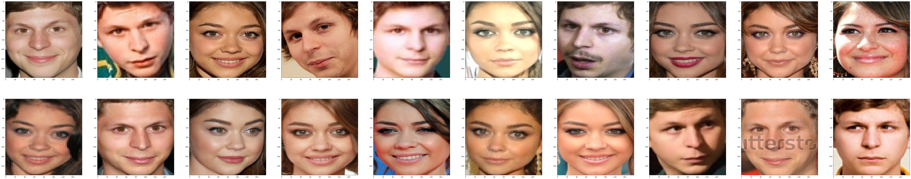
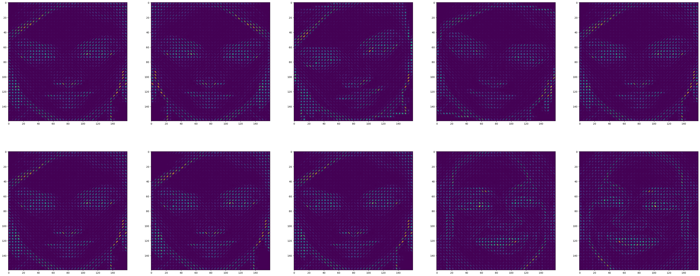
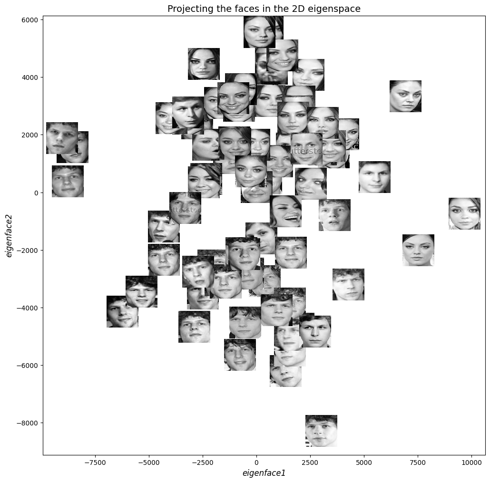
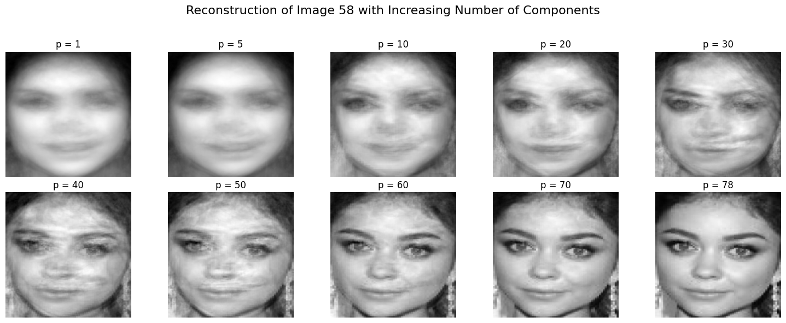

# Face Recognition with Handcrafted and Learned Features

This project was developed as part of the Computer Vision course (H02A5a) at KU Leuven. It explores advanced techniques for constructing feature representations and performing face recognition using both handcrafted and data-driven methods. The work culminated in a Kaggle competition where we applied and evaluated our full pipeline.

## Project Goal

The main objective was to **detect and classify difficult faces**, particularly distinguishing between visually similar individuals (Jesse Eisenberg vs. Michael Cera, Mila Kunis vs. Sarah Hyland). This required building robust and discriminative feature representations and evaluating their effectiveness in a real-world-inspired classification task.

## Project Overview

We developed a comprehensive face recognition pipeline that includes:

- **Preprocessing**: Face detection and alignment using OpenCV and RetinaFace.
- **Feature Extraction**:
  - **Handcrafted**: Histogram of Oriented Gradients (HOG).
  - **Learned**: Principal Component Analysis (PCA) for eigenfaces.
- **Classification**: Multi-class and binary classifiers to distinguish between lookalikes.
- **Evaluation**: Accuracy on test data and qualitative analysis using t-SNE and PCA visualizations.
- **Kaggle Submission**: Final pipeline submitted to a course-specific Kaggle competition.

## Assignment Objectives

This project addresses the following key questions:

- **Feature Construction**: How can we build effective feature representations using both handcrafted descriptors and features learned from data?
- **Classification Strategy**: How can these feature representations be utilized and compared within the context of classifying faces, particularly distinguishing between similar-looking individuals?
- **Pipeline Improvement**: What improvements can be made in face detection, feature extraction, and model classification to enhance overall performance?
- **Preprocessing and Data Quality**: What preprocessing steps are necessary to ensure clean, robust, and discriminative features?
- **Real-world Application**: How do these approaches translate to real-life scenarios where more training data may be available, but detection conditions are more challenging?

## Final Model: Deep Learning Pipeline

To push performance further, we integrated a deep learning-based pipeline using the **DeepFace** framework. This allowed us to leverage state-of-the-art models and techniques:

### Face Detection: RetinaFace

- RetinaFace with a ResNet50 backbone was used for accurate face localization and alignment.
- Eye landmarks were used to align faces horizontally, improving recognition accuracy.

### Feature Extraction: VGG-Face Embeddings

- We used **VGG-Face**, a 22-layer deep neural network, to extract embeddings from face images.
- **Euclidean distance** was used to compare embeddings and determine identity similarity.

### Thresholding & Similarity

- A threshold was tuned to distinguish between same-person and different-person embeddings.
- This was critical for robust classification in ambiguous cases.

### Data Augmentation: Albumentations

We applied strong augmentations to improve generalization:

- **Geometric**: Horizontal flip, rotation, shift-scale-rotate.
- **Color**: Brightness/contrast adjustment, CLAHE, color jitter.
- **Noise/Blur**: Gaussian noise, blur.

These augmentations helped simulate real-world variability and improve model robustness.

## Visualizations

### HOG image

This plot shows a **HOG image** composed of line segments within each cell, oriented according to the angle of each histogram bin and scaled in brightness and length based on their gradient magnitudes.

### PCA Projection of Faces in 2D

This plot shows how different faces are distributed in the 2D eigenspace formed by the first two principal components.

### Image Reconstruction with Increasing PCA Components

This visualization demonstrates how the quality of face reconstruction improves as more principal components are used.

## 💡 Key Insights
- HOG features provided strong local structure representation but were sensitive to lighting and pose.
- PCA-based eigenfaces captured global facial characteristics and allowed dimensionality reduction.
- Combining robust preprocessing with discriminative features significantly improved classification accuracy.
- The Kaggle test set contained mislabeled or incorrect images, making perfect accuracy unattainable.

## 🛠️ Technologies Used

- Python
- OpenCV
- Scikit-learn
- Matplotlib / Seaborn
- t-SNE (via scikit-learn)
- Kaggle API

## 👥 Team Contributions

| Name              | Contribution                                                                 | Private Repo Link |
|-------------------|------------------------------------------------------------------------------|-------------------|
| John Ferderigos|Implemented HOG feature extraction and visualization. Researched different face detection approaches | GitHub |
| Vassilis Panagakis| Developed PCA pipeline and eigenface visualizations | [GitHub](https://github.com/vm-panag) |
| Jordi Beltran Perello| Built and evaluated classifiers, handled cross-validation, managed Kaggle submissions| [GitHub](https://github.com/jordibelp) |
| Fotis Kalioras| Preprocessing, face detection improvements, and final report writing and notebook synthesis| [GitHub](https://github.com/fothot2) |

## Limitations & Future Work

- The test set contained mislabeled images, limiting achievable accuracy.
- With more time, we would:
  - Explore deep learning models and embeddings.
  - Further refine preprocessing steps for robustness.
  - Investigate ensemble methods or hybrid feature strategies.